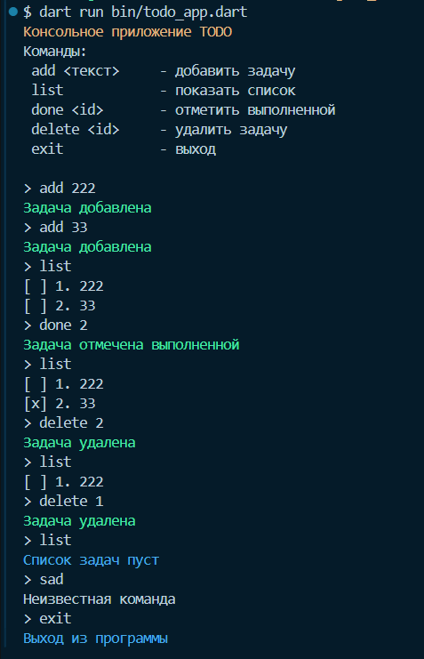

# Todo App (Dart CLI)

Консольное приложение для управления списком задач (ToDo), написанное на языке Dart. Приложение позволяет добавлять, просматривать, отмечать как выполненные и удалять задачи через командную строку.

## Автор

**Имя:** Катаржин Г.М.

**Группа:** ИСП-232

## Скриншот приложения




## Как запустить

1. Убедитесь, что у вас установлен Dart SDK 3.0+:
   ```bash
   dart --version
   ```

2. Клонируйте репозиторий:
   ```bash
   git clone <URL_вашего_репозитория>
   cd todo_app
   ```

3. Установите зависимости:
   ```bash
   dart pub get
   ```

4. Запустите приложение:
   ```bash
   dart run bin/todo_app.dart
   ```

5. Используйте команды в консоли:
   - `add <текст>` — добавить задачу
   - `list` — показать все задачи
   - `done <id>` — отметить задачу выполненной
   - `delete <id>` — удалить задачу
   - `exit` — выйти из приложения

## Что изучили

- Основы синтаксиса Dart: null safety, вывод типов (`var`), неизменяемые переменные (`final`, `const`)
- Создание классов, конструкторов (включая именованные), переопределение методов
- Организация кода: разделение логики на модели (`Todo`) и репозитории (`TodoRepository`)
- Асинхронность в Dart: использование `Future`, `async/await`, неблокирующее ожидание
- Подключение внешних пакетов через `pub.dev` (например, `ansicolor` для цветного вывода)

## Ответы на вопросы

### 1. Чем `final` отличается от `const` в Dart?

- `final` — значение определяется во время выполнения (runtime), может быть вычислено динамически. Присваивается один раз.
- `const` — значение известно на этапе компиляции (compile-time), не может зависеть от runtime-вычислений. Используется для констант UI или других статических данных.

Пример:
```dart
final x = DateTime.now(); // OK
const y = DateTime.now(); // Ошибка!
```

### 2. Что означает `String?`

`String?` — это nullable тип строки. Переменная такого типа может содержать либо строку, либо `null`. Это часть системы Sound Null Safety в Dart, которая гарантирует безопасность обращения к null-значениям на этапе компиляции.

Пример:
```dart
String name = 'Артём';     // Не может быть null
String? name2 = null;      // Может быть null
```

### 3. Чем `Future` отличается от обычного значения? Что означает `await` с точки зрения потока выполнения?

- `Future<T>` — объект, представляющий результат асинхронной операции, который будет доступен позже. Он не блокирует поток выполнения.
- Обычное значение доступно немедленно.
- `await` приостанавливает выполнение текущей асинхронной функции до завершения `Future`, но **не блокирует основной поток**. Другие события могут обрабатываться параллельно (через event loop).

Пример:
```dart
Future<String> fetchData() async {
  await Future.delayed(Duration(seconds: 1));
  return 'Data';
}

void main() async {
  print('Start');
  String data = await fetchData(); // Ждёт 1 сек, но не блокирует поток
  print(data);
}
```

### 4. Зачем в Dart именованные конструкторы, если в C# есть перегрузка?

В Dart нет перегрузки конструкторов (как в C#). Вместо этого используются именованные конструкторы, чтобы предоставить несколько способов создания объекта с разными параметрами или логикой инициализации.

Пример:
```dart
class Todo {
  final int id;
  String title;

  Todo(this.title) : id = ++_counter; // Основной конструктор
  Todo.empty() : title = '', id = 0;  // Именованный конструктор
}
```

Это делает код более читаемым и явным, особенно при работе с Flutter, где часто используются именованные параметры и конструкторы.
